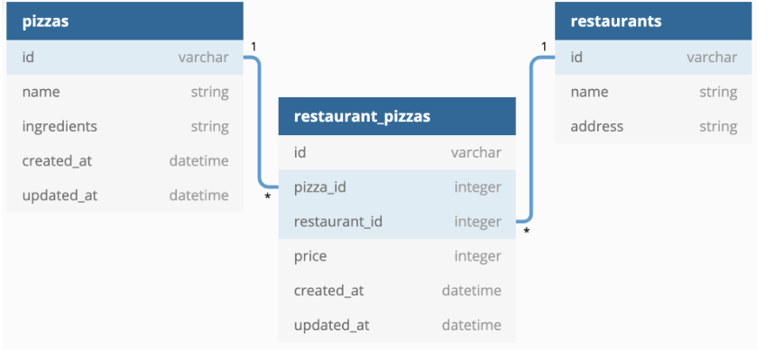

# pizza-restaurants-code-challenge
This is a simple project that creates a RESTful API for pizza-restaurants database.
The database contains three tables:
  * pizza-restaurants
  * restaurants
  * pizzas
* A `Restaurant` has many `Pizzas` through `RestaurantPizza`
* A `Pizza` has many `Restaurants `through `RestaurantPizza`
* A `RestaurantPizza` belongs to a Restaurant and belongs to a `Pizza`

