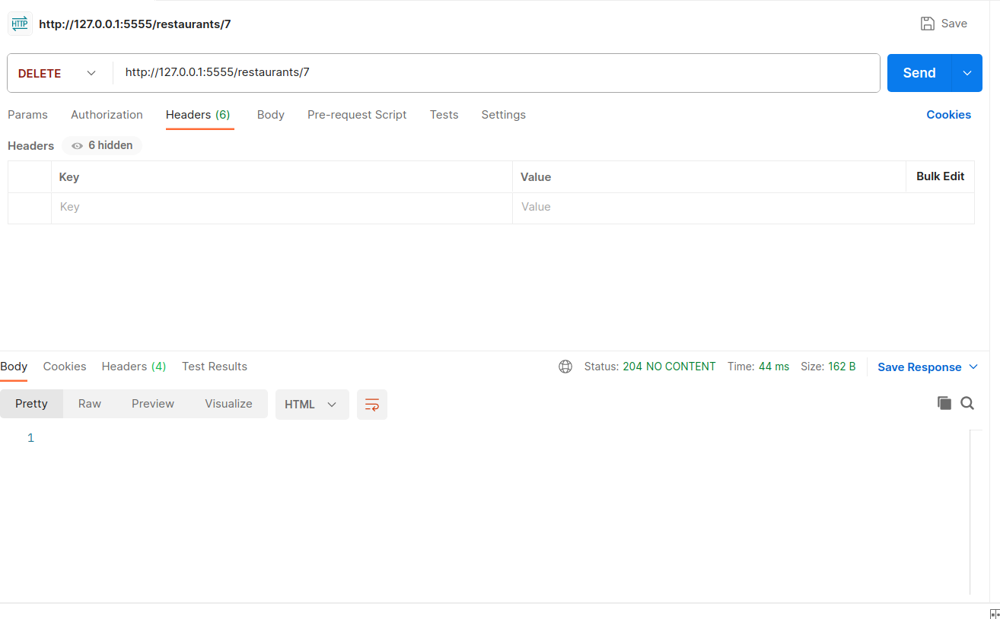
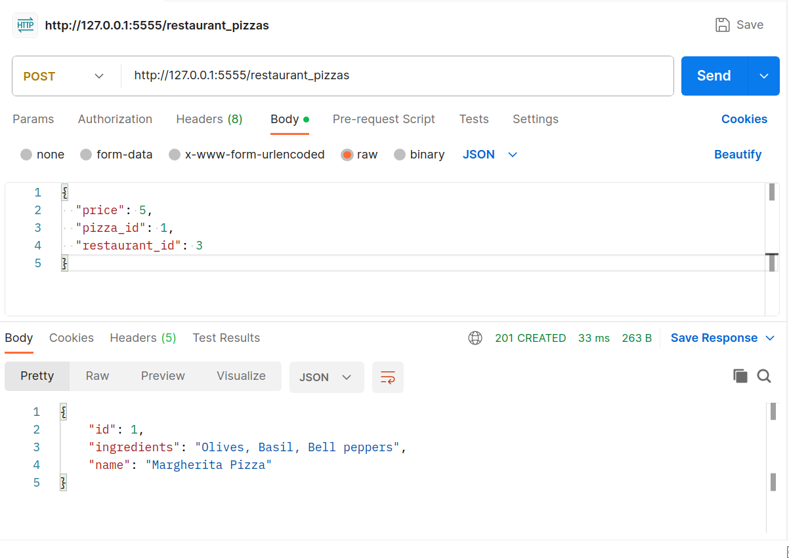

# pizza-restaurants-code-challenge
This is a simple project that creates a RESTful API for pizza-restaurants database.
The database contains three tables:
  
* A `Restaurant` has many `Pizzas` through `RestaurantPizza`
* A `Pizza` has many `Restaurants `through `RestaurantPizza`
* A `RestaurantPizza` belongs to a Restaurant and belongs to a `Pizza`


## Table of Contents
- [Technologiesused](#technologiesused)
- [Installation](#installation)
- [Usage](#usage)

- [Author & License](#author--license)

## Technologies used


## Installation

### 1. Clone the repository

```bash
git clone https://github.com/JOY19ANYANGO/pizza-restaurants-code-challenge.git
```

### 2. Navigate to the project's directory

```bash
cd pizza-restaurants-code-challenge
```

### 3. Install all the required dependencies

The root directory of this repository contains the `Pipfile` with all the required Python libraries for this project and restricts them to this repository.

To install the required libraries, run:

```python
pipenv install
```

### 4. Enter the pipenv shell

```python
pipenv shell
```
### 5.Set up the server
```python
cd server ; python3 app.py
```
* Run `python3 seed.py` to populate database.

## Usage
The REST API allows  various HTTP methods:
   * Retrieve records of all restaurants.
   * Retrieve one restaurant.
   * Delete a restaurant.
   * Retrieve records of all pizzas.
   * Create a new restaurant_pizza.

###  Retrieve records of all restaurants.
To retrieve records of all restaurants navigate to the following URL:`http://127.0.0.1:5555/restaurants`
### Retrieve one restaurant
To retrieve one restaurant use the following URL:`http://127.0.0.1:5555/restaurants/:id`.Replace id with the actual id of the restaurant

### Delete one restaurant.
We can delete a restaurant using postman.
1. Enter the following URL:`http://127.0.0.1:5555/restaurants/:id`.Replace id with the actual id of the    restaurant
2. Select the DELETE method and press send.

 When you press send again you should receive a response
```json
{
  "error": "Restaurant not found"
}
```
This shows that the restaurant has been deleted hence it is no longer available.

### Retrieve records of all pizzas.
To retrieve records of all restaurants navigate to the following URL:`http://127.0.0.1:5555/pizzas`

### Create a new restaurant_pizza.
We can delete a restaurant using postman.
1. Enter the following URL:`http://127.0.0.1:5555/restaurant_pizzas`
2. Select the POST method.
3. In the request body enter the following.
```json
{
  "price": 5,
  "pizza_id": 1,
  "restaurant_id": 3
}
```
* Press send

* You should receive a JSON response of the pizza object and status code 201.This shows that the item was successfully created.


## Author & License

Authored by [Joy Anyango](https://github.com/JOY19ANYANGO).

Licensed under the [MIT](https://choosealicense.com/licenses/mit/)